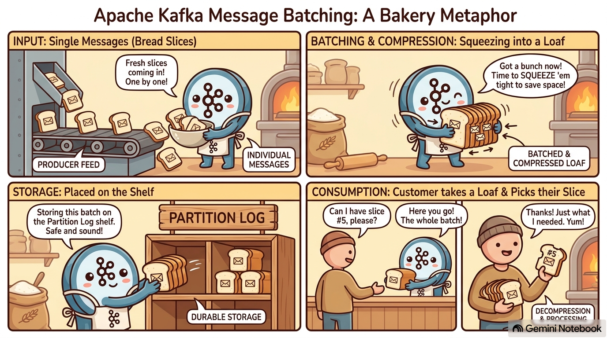

*First in the [Kafka Internals](/posts/kafka/) series: reading the design doc against the actual source (Kafka trunk, 4.5.0-SNAPSHOT, KRaft-only). Every number below came off a single-node broker running on my laptop, and you can reproduce all of them.*

Kafka's API is message-shaped. You call `producer.send(record)` with one record. You call `consumer.poll()` and iterate `ConsumerRecord`s one at a time. The docs say "message" everywhere. So the obvious mental model is: a message goes in, a message sits on disk, a message comes out.

All three of those are wrong, and they're wrong in the same way. **Kafka's unit is the batch.** The producer builds batches, the broker stores batches without ever looking inside them, the index points only at batch boundaries, and the consumer is handed whole batches and throws away the records it didn't ask for.

That isn't an optimisation layered on top of a message store. It's the shape of the thing.



I thought of this corollary while reading through the batching flow, and generated the graphic above with NotebookLM to make it simpler to hold on to. (It really did stick in my head, lol. NotebookLM for the win, lessgo.) Hope it helps you as much as it helped me.

## A single message costs 79 bytes

Start with the smallest thing you can put in Kafka. One topic, one partition, one record with an 11-byte payload and no key:

```bash
printf 'hello-kafka\n' | bin/kafka-console-producer.sh --topic m1.one --bootstrap-server $B
stat -f "%z bytes" $LOG_DIR/m1.one-0/00000000000000000000.log
```

```
79 bytes
```

Seventy-nine bytes for eleven bytes of payload. Where did the other 68 go? Dump the segment and the shape appears:

```
baseOffset: 0 lastOffset: 0 count: 1 baseSequence: 0 lastSequence: 0 producerId: 0
producerEpoch: 0 partitionLeaderEpoch: 0 isTransactional: false isControl: false
position: 0 CreateTime: 1789659819234 size: 79 magic: 2 compresscodec: none
crc: 3458659970 isvalid: true
| offset: 0 CreateTime: 1789659819234 keySize: -1 valueSize: 11 sequence: 0 payload: hello-kafka
```

Two levels, and the tool renders them differently on purpose. The unindented line is a **RecordBatch**. The `|`-prefixed line under it is a **Record**. There is no format in which the record appears on its own. Even a single message gets a batch wrapped around it.

The batch header is fixed-width, and you can add it up from `DefaultRecordBatch`:

```
BaseOffset           Int64    8
Length               Int32    4
PartitionLeaderEpoch Int32    4
Magic                Int8     1
CRC                  Uint32   4
Attributes           Int16    2
LastOffsetDelta      Int32    4
BaseTimestamp        Int64    8
MaxTimestamp         Int64    8
ProducerId           Int64    8
ProducerEpoch        Int16    2
BaseSequence         Int32    4
RecordsCount         Int32    4
                          = 61 bytes
```

That's `RECORD_BATCH_OVERHEAD`, and it's 61 whether the batch holds one record or ten thousand. 61 + 18 bytes of record = 79.

So the per-message overhead isn't 68 bytes. It's 61 bytes **per batch**, which becomes 68 bytes per message only if you're pathological enough to put one message in each.

## Records are deltas, which is why they shrink

Look at what the inner record *doesn't* store:

```
Length         Varint
Attributes     Int8
TimestampDelta Varlong
OffsetDelta    Varint
KeyLength      Varint
Key            Bytes
ValueLength    Varint
Value          Bytes
HeadersCount   Varint
Headers        [Header]
```

No absolute offset. No absolute timestamp. No producer id, no epoch, no sequence number. Every one of those lives exactly once, in the batch header, and each record carries only a **delta** from it, varint-encoded, so small deltas cost one byte.

This is the second half of the batching payoff. The first half is amortising a 61-byte header. The second is that being inside a batch is what makes a record cheap: it gets to describe itself relative to its neighbours.

Produce the same 11-byte payload 1, 10, and 1000 times into fresh topics and the effect is brutal:

| records | batches | bytes on disk | bytes/record |
| --- | --- | --- | --- |
| 1 | 1 | 79 | 79.0 |
| 10 | 1 | 241 | 24.1 |
| 1000 | 2 | 18,994 | 19.0 |

The per-record cost falls from 79 bytes to 19: the same payload, a 4x difference in what it costs to store, decided entirely by how many neighbours it arrived with.

The numbers are also exactly predictable, which is the part I enjoyed most:

```
size = 61 + min(n, 64)×18 + max(n − 64, 0)×19
```

Exact for every row. Two things worth pulling out of it.

**Why 18 bytes per record.** Length 1, Attributes 1, TimestampDelta 1, OffsetDelta 1, KeyLength 1 (zigzag −1, meaning null), ValueLength 1, Value 11, HeadersCount 1.

**Why it steps to 19 at record 65.** `OffsetDelta` is a zigzag varint. `zigzag(63) = 126`, which fits in a single byte; `zigzag(64) = 128`, which doesn't. So the 65th record in every batch is one byte more expensive than the 64th, forever. Records in a batch are not uniformly sized, and the size depends on *position*.

**Why 1000 records made two batches.** `batch.size` defaults to 16384. Batch one closed at 16,375 bytes holding 862 records, because the 863rd would have taken it to 16,394. The remaining 138 went into a second batch of 2,619. 16,375 + 2,619 = 18,994, which is the number on disk.

Nothing here is estimated. The format is tight enough that you can predict the byte count of a segment before you write it.

## Compression happens to the batch, not the message

Attributes bits 0–2 hold the compression codec. When it's set, everything after `RecordsCount` (the whole record array) becomes **one compressed blob**. Not one compressed field per record. One blob per batch.

That matters because 1000 near-identical records compress against *each other*. Same 1000 records, four ways:

| setup | codec | batches | bytes | bytes/record |
| --- | --- | --- | --- | --- |
| default batching | none | 2 | 18,994 | 19.0 |
| default batching | gzip | 2 | **2,092** | 2.1 |
| `batch.size=0` | none | 1000 | 79,000 | 79.0 |
| `batch.size=0` | gzip | 1000 | **99,000** | 99.0 |

Read the last two rows twice. With batching turned off, **gzip made the data 25% bigger**. Every record became its own batch, so every record got its own gzip stream, and a gzip header and trailer wrapped around 18 bytes of payload costs more than the payload.

Compression isn't a property of your data in Kafka. It's a property of how your data was grouped before it got compressed, and if you've disabled batching you have disabled compression's ability to do anything except add overhead.

The other half of the design is what the broker does with that blob: **nothing**. It stores the compressed bytes exactly as the producer sent them, and serves them to the consumer exactly as it stored them. The broker never decompresses to serve a fetch. The producer compresses, the consumer decompresses, and the bytes in between are untouched by anyone.


The baker doesn't slice the loaf to shelve it, and doesn't slice it to sell it either. It's squeezed once, on the way in, and unwrapped once, by whoever eats it. Every hop in between handles the same sealed loaf.

Which is the whole reason the shelf can be as fast as it is. A shelf that had to unwrap and re-wrap every loaf to check what's inside would be doing real work per loaf. This one just moves loaves.


## Where the batches land

So a batch is the thing that gets written. Written *where*, exactly?

The storage layout is three nouns and no surprises:

- **A partition is a directory.** `<topic>-<partition>`, e.g. `m2.log-0`.
- **A segment is a file** inside it, named by the **base offset** of the first record it holds, zero-padded to 20 digits.
- **A segment file is batches, back to back**, with nothing between them. No framing, no separators, no per-file header. The batch's own `Length` field at byte 8 is how you find the next one.

Here's a real partition directory (5000 records, segments forced small so it rolls often):

```
00000000000000000000.index          24
00000000000000000000.log        65,400
00000000000000000000.timeindex      36
00000000000000000316.index          24
00000000000000000316.log        65,400
00000000000000000316.timeindex      24
...
00000000000000004740.index  10,485,760
00000000000000004740.log        53,849
00000000000000004740.timeindex 10,485,756
```

Sixteen segments. The filename *is* the addressing scheme: to find the segment holding offset 1000, take the greatest base offset ≤ 1000. That's `LogSegments.floorSegment`, a `ConcurrentNavigableMap.floorEntry` underneath. No scan, no metadata file, not even a directory listing at read time.

Segments exist for one reason: **deletion granularity**. Retention can't cheaply truncate the head of a file, but it can `unlink` one. So the log rolls when the active segment exceeds `segment.bytes`, or `segment.ms` elapses (default 7 days), or the index fills. Only the last segment is writable; everything before it is immutable, which is what makes a lot of later machinery legal.

There's a fun consequence of that hiding in plain sight: **a message can outlive its own retention.**

Deletion works on whole files, so Kafka has to pick one timestamp per segment to judge it by, and it picks the newest one. From `UnifiedLog.deleteRetentionMsBreachedSegments`:

```java
long anchorTimestamp = segment.largestTimestamp();
// ...
boolean delete = startMs - anchorTimestamp > retentionMs;
```

`largestTimestamp()` is the youngest record in the segment. So a segment only becomes eligible for deletion once its *newest* record is past retention, and every older record sharing that file rides along for free.

On a busy topic nobody notices, because segments fill and roll in minutes. On a low-traffic topic it's very visible. Say a message lands on Monday, the topic then does almost nothing, and a second message trickles in six days later. That second message has just reset the clock for the entire file. The Monday message is now past a 7-day retention and still sitting on disk, fully readable, purely because of which file it happens to share.

The ceiling is `segment.ms`, since a segment stops accepting records once it rolls. On defaults both `retention.ms` and `segment.ms` are 7 days, so on a quiet topic a record can legitimately survive close to 14 days. Retention is a floor, not a deadline, which is worth knowing if you've ever pointed at `retention.ms` to argue that data is gone.

Back to the bakery: you don't bin one slice, you bin the loaf, and the loaf only goes out when its freshest slice has turned.

Now look at that last stanza again. The active segment's `.index` is **10 MB** while every rolled one is 24 bytes. Indexes are memory-mapped, and growing a mapped file means unmapping, resizing and remapping under a write lock, so Kafka buys that away by preallocating the full `segment.index.bytes` (10 MB default) at birth and trimming it down to `entrySize × entries` when the segment rolls. The oversized index is how you spot the active segment from an `ls`.

## The index points at batches, never at records

Each `.index` entry is 8 bytes: a **relative** offset (4 bytes, relative to the segment's base offset, which is where the saving comes from) and a file position (4 bytes). It's sparse, and the sparseness is the design.

The five lines that build it, from `LogSegment.append`:

```java
if (bytesSinceLastIndexEntry > indexIntervalBytes) {
    offsetIndex().append(batchLastOffset, physicalPosition);
    timeIndex().maybeAppend(maxTimestampSoFar(), shallowOffsetOfMaxTimestampSoFar());
    bytesSinceLastIndexEntry = 0;
}
var sizeInBytes = batch.sizeInBytes();
physicalPosition += sizeInBytes;
bytesSinceLastIndexEntry += sizeInBytes;
```

The loop is over **batches**. `batchLastOffset`, `batch.sizeInBytes()`. An index entry can never point into the middle of a batch, because the code that writes entries never sees the middle of a batch.

Here's that segment's index, dumped:

```
offset: 473 position: 16350
offset: 552 position: 32700
offset: 631 position: 49050
```

And the batches in the file it indexes:

```
baseOffset: 316 lastOffset: 394 count: 79    (position 0)
baseOffset: 395 lastOffset: 473 count: 79    (position 16350)
baseOffset: 474 lastOffset: 552 count: 79    (position 32700)
baseOffset: 553 lastOffset: 631 count: 79    (position 49050)
```

Every index entry is a batch's **last** offset pointing at where that batch **starts**. Three observations fall out, and each one contradicts a reasonable guess:

**The entries are 16,350 bytes apart, but `index.interval.bytes` is 4096.** The interval is a floor, not a spacing. Each batch here is 16,350 bytes, bigger than the interval on its own, so every batch trips the check. You cannot get entries closer together than one per batch no matter how small you set the interval.

**Four batches, three entries.** The check is `>` and it runs *before* the counter is incremented, so the first batch of a segment is never indexed. A lookup below the first indexed offset falls back to position 0 and scans from the top of the file.

**The segment is 65,400 bytes = 4 × 16,350.** Every number in that directory listing is downstream of the batch size.

One more thing about the index, which I found genuinely surprising: it has **no checksum**. From the javadoc: *"No attempt is made to checksum the contents of this file, in the event of a crash it is rebuilt."* The index holds nothing that isn't derivable from the `.log`. It's a pure cache, which means index corruption is never a data-loss event.

## Finding offset 12345

The design doc says "constant time suffices," which is a claim worth calling. Lookup is not O(1). `LogSegment.translateOffset` is four lines and it's two different algorithms:

```java
LogOffsetPosition translateOffset(long offset, int startingFilePosition) throws IOException {
    OffsetPosition mapping = offsetIndex().lookup(offset);
    return log.searchForOffsetFromPosition(offset, Math.max(mapping.position(), startingFilePosition));
}
```

**Phase one:** binary search the mmap'd index for the greatest indexed offset ≤ target. O(log n) over a structure small enough to stay resident.

**Phase two:** from that file position, read batch **headers** forward until you find the batch whose last offset ≥ target. It uses each batch's `Length` field to skip over payloads without reading them.

The scan in phase two is what makes it not-O(1), and it's also the point. A dense index (one entry per record) would need no scan, but it would be enormous and it would thrash the page cache. Kafka trades a small cache-resident index plus a short scan for a large index plus no scan. Because entries are spaced by bytes written, the scan is bounded by roughly `index.interval.bytes` plus one batch: **a few KB, no matter how large the log is.**

That's what "constant time suffices" actually means. Not that lookup is O(1), but that the non-constant part runs over something small enough to stay in memory, and the part that touches the log is a fixed-size window.

And note what phase two returns. Not a record. A **batch**.

## The consumer is handed the loaf

This is the panel people don't expect, and it's the cleanest evidence that the batch is the unit rather than an implementation detail.

Kafka never seeks to a record. Ask for offset 12345 and the broker finds the batch containing it and sends you that whole batch, including the records before 12345 that you did not ask for. The filtering happens on the **client**, in `CompletedFetch.nextFetchedRecord`:

```java
currentBatch = batches.next();
// ...
records = currentBatch.streamingIterator(decompressionBufferSupplier);
```

```java
Record record = records.next();
// skip any records out of range
if (record.offset() >= nextFetchOffset) {
    // ...
    return record;
}
```

Both halves of the story are in those two fragments. `streamingIterator(decompressionBufferSupplier)` is where decompression happens: in your application's process, not the broker's. And `if (record.offset() >= nextFetchOffset)` is the consumer quietly discarding records it was sent and didn't want.

So `poll()` returning you one `ConsumerRecord` at a time is a client-side presentation layer over a batch that arrived whole. The API's shape and the system's shape are different things.

Why do it this way? Because narrowing further would mean **re-encoding**. To hand you offset 12345 and nothing else, the broker would have to decompress the batch, strip the records you don't want, rebuild the header, recompute deltas, recompute the CRC, and recompress. Per consumer, per fetch. It would have to become a system that transforms data rather than one that moves it.

## The thing underneath all of it

Every section above is the same decision seen from a different angle: **the producer, the disk and the consumer use the exact same bytes, with no translation at any hop.**

The format the producer builds is the format the broker writes, is the format the consumer receives. That's why the broker can store compressed blobs it never opens. It's why an index entry can only ever be a batch boundary. It's why the consumer has to do its own filtering. And it's the precondition for the efficiency claim I haven't touched yet: that the broker can serve a fetch by handing the kernel a file region and a socket, and never copying the data into user space at all.

The cost of that decision is that the format can't be changed casually. It's simultaneously a disk format, a wire format, and a compatibility contract with every client ever written. Kafka has changed it twice in its life.

## Takeaways

1. **Per-message overhead is 61 bytes per batch, not per message.** An 11-byte payload costs 79 bytes alone and 19 bytes in a crowd. If your throughput numbers assume the former, they're wrong by 4x.
2. **Turning off batching turns off compression's ability to help.** With `batch.size=0`, gzip made my data 25% *bigger*. Compression compresses a batch, so no batch means no compression, just overhead.
3. **The batch is the smallest addressable thing on disk.** Index entries land only on batch boundaries, `index.interval.bytes` is a floor rather than a spacing, and a lookup resolves to a batch.
4. **Your consumer receives and decompresses records it didn't ask for,** and does the filtering itself. That's client CPU you're paying for, and it scales with batch size.
5. **An oversized `.index` is how you spot the active segment.** 10 MB preallocated and mmap'd, trimmed on roll.

---

*Everything above was measured against Apache Kafka trunk (4.5.0-SNAPSHOT) on a single-node KRaft broker. Source references are to `clients/…/record/internal/` and `storage/…/log/`. Note the record classes moved to `org.apache.kafka.common.record.internal` on trunk, so most references you'll find online point at the old package.*
