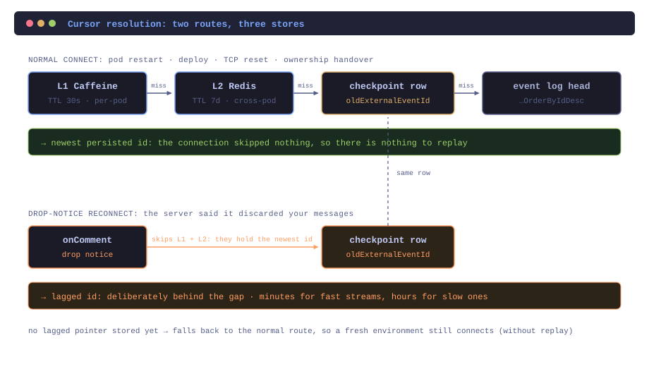

Picture a service consuming events over Server-Sent Events: a handful of long-lived streams, one owning pod each, running all day. For a consumer like this the interesting code isn't the parsing. It's what happens when the stream breaks, because it will, and the only question that matters then is *where do you start reading again*.

Every SSE guide answers that the same way: `Last-Event-ID`. Keep the id of the last event you saw, send it on reconnect, the server resumes after it. That's the protocol's answer and it's a good one.

It is also the correct answer to exactly one failure mode, and not the one that actually loses you events.

Short version: **put the cursor in three places (an in-process cache, Redis, and a durable checkpoint row), and make the third one something other than a third level of cache. It should hold a deliberately older value than the other two.** Which store a reconnect reads from depends on *why* it is reconnecting. A dropped connection skipped nothing, so resuming from the newest id you persisted is complete. A stream that told you it was dropping events did skip something, and that same newest id resumes you past the gap.

## The cursor, concretely

Servers take the cursor either in the `Last-Event-ID` header or as a query parameter on the stream URL. Either way the semantics are the same: connect with it and you get everything after that id, connect without it and you get the live stream only, from now.

One wrinkle before the rest makes sense: the ids are not unique *across* streams. Two different streams can both hand you event `53990`. So namespace on the way into storage and strip it on the way back out:

```kotlin
// stored as accounts#53990, sent to the wire as 53990
val lastEventId = resolveCursor(stream)?.substringAfter("#")
```

Anything that persists cursors from more than one stream needs some version of this. Discovering it late is unpleasant, because the symptom is one stream resuming from another stream's position, which looks like data corruption rather than an id collision.

## Stores one and two: the caches

The first two are a conventional two-tier cache, and they hold the same value: the newest id the consumer has persisted.

```kotlin
fun cachedCursor(stream: Stream): String? {
    // L1: in-memory
    local.getIfPresent(stream)?.let { return it }

    // L2: Redis
    return redis.get<String>(cursorKey(stream))?.also {
        local.put(stream, it)        // populate L1 on the way back
    }
}
```

L1 is Caffeine with a **30-second** expiry. That looks aggressively short for a value which changes on every event, and the shortness is the point: exactly one pod owns a given stream at a time, and ownership moves. The owning pod refreshes L1 on every persist, so the TTL never bites there. On every *other* pod, it guarantees that a stale local value cannot outlive ownership by more than half a minute.

L2 is Redis, keyed `cursor:<stream>`, with a TTL measured in days. It is what survives a pod restart, and what makes ownership handover cheap: the pod picking up the stream reads a warm cursor instead of going to the database.

The L2 *write* is where it gets more interesting:

```kotlin
scope.launch {
    val current = redis.get<String>(key)
    if (current == null || newId > current) {
        redis.put(key, newId)
    }
}
```

That write is asynchronous, so during a handover two pods can have writes in flight simultaneously, and they can land out of order. A plain `SET` would let an older in-flight write clobber a newer value and quietly rewind the cursor. Since the ids are monotonic, a lexicographic compare is a sufficient fence: **only ever move the cursor forward.** It costs one extra `GET` and removes an entire class of ordering bug. The batch path does the same thing behind a single `MGET` round trip.

If Redis is unreachable the write is logged and dropped. L1 still holds the value and the database is still underneath; a cache that failed closed on its write path would be strictly worse than one that occasionally misses.

## Store three is not a cache

Here is the full read path. The thing to notice is what sits *after* the cache:

```kotlin
fun resolveCursor(stream: Stream): String? =
    cachedCursor(stream)                        // L1, then L2
        ?: checkpoints.read(stream)?.laggingId   // the deliberately stale row
        ?: headFromEventLog(stream)              // floor: newest event persisted
```

Three stores, then a floor: if all of them miss, the floor runs an `ORDER BY id DESC LIMIT 1` against wherever events are persisted and returns the actual head. That floor is what makes a cold start work at all.

The checkpoint row in the middle *looks* like a third cache tier. It isn't. Look at the field it reads: the lagging id, not the latest one. That row is maintained by a periodic job which only advances a stream's pointer once a replay window has elapsed, minutes for a fast stream, hours for a slow one. The row is *supposed* to lag. It's a deliberately stale cursor, maintained on purpose, and it is the only store in the chain that can answer "where was I before the last few hours happened".


The caches are your thumb on the page, exactly where you stopped reading. The checkpoint row is the bookmark you slide into the spine, and you only move it once you're confident you've taken in everything up to it.

Most of the time you resume from your thumb, because it's precise and it's right there. But if someone tells you pages were torn out while you weren't looking, your thumb is worse than useless: it points *past* the damage. The bookmark is behind on purpose, and that is the only reason it can help you.


## Two routes through the same chain

So the reconnect path forks on a single boolean, and that boolean is not "did we fail", it's "did we *miss* anything":

```kotlin
val lastEventId = if (droppedByServer) {
    resolveLaggedCursor(stream)
} else {
    resolveCursor(stream)
}
```

The lagged resolver doesn't merely *prefer* the checkpoint row; it **skips the caches entirely**:

```kotlin
fun resolveLaggedCursor(stream: Stream): String? =
    checkpoints.read(stream)?.laggingId
        ?: resolveCursor(stream)
```

Resolving through the cache here would defeat the whole exercise, because the cache is never stale; it always holds the newest persisted id, which is precisely the value that resumes the stream *after* the gap. The fallback matters too: a stream with no lagged pointer yet, on a fresh environment, still connects. It just connects without replay, which is the right way to degrade.



When does each apply?

| why you're reconnecting | did you miss events? | resume from |
| --- | --- | --- |
| pod restart, deploy | no | newest |
| TCP reset, read timeout | no | newest |
| ownership moved to another pod | no | newest |
| the server told you it dropped you | **yes** | lagged |

The first three rows are what every tutorial covers, and for all of them `Last-Event-ID` semantics aren't merely adequate, they're optimal: you missed nothing, so replaying anything at all is pure waste.

The last row is the one usually treated as an edge case, and it's the only row where the events are *already gone*. SSE has a frame type for exactly this: a comment line, which most consumers never register a handler for. A server under backpressure can use it to tell you it has begun discarding your messages. Nothing else in the protocol will: the stream stays open, the parser stays happy, and the events simply aren't there. If your reconnect logic has only one cursor, you will faithfully resume from a position on the far side of a hole you were explicitly warned about.

## What replay costs

Worth being straight about the trade-off, because replay isn't free and treating it as an unalloyed good is its own mistake.

A drop-notice reconnect re-reads the whole replay window, potentially hours of a stream, and it does so at precisely the moment that consumer is already demonstrably too slow to keep up. Handing a backlog to something that is behind can push it further behind. Throttling how *often* this can fire (say one reconnect per stream per minute) bounds frequency, not volume. Under sustained pressure this design trades throughput for completeness, deliberately, and you want to know that's the trade you're making.

It also only works if persistence is idempotent. Replaying a window means re-delivering every event inside it, and if the write path isn't dedupe-safe on the event id, replay converts silent data loss into loud data corruption: a worse failure, not a better one. The dedupe is load-bearing, not an optimisation.

## Takeaways

1. **"Resume from the last id" answers the wrong question.** The right question is whether you missed anything, and that depends on *how* the connection ended, not merely that it ended.
2. **A cursor cache and a replay pointer are different values, not two tiers of one.** Stacking them is tempting and wrong: the entire value of the replay pointer is that it is stale, which is the one property a cache exists to eliminate.
3. **Implement `onComment`.** It is the only channel a server has to tell you it is dropping you, and the default implementation in most clients is an empty method.
4. **Make cache writes monotonic wherever ownership can move.** Async writes from two pods land in arbitrary order; if the value only ever moves forward, the ordering stops mattering.
5. **Namespace event ids per stream** before they reach shared storage, or you will one day debug one stream resuming from another's position.

---

*The code samples are illustrative sketches of the design, not production source. The TTLs, replay windows and throttle intervals are example values: derive yours from how far behind your consumer can afford to be.*
